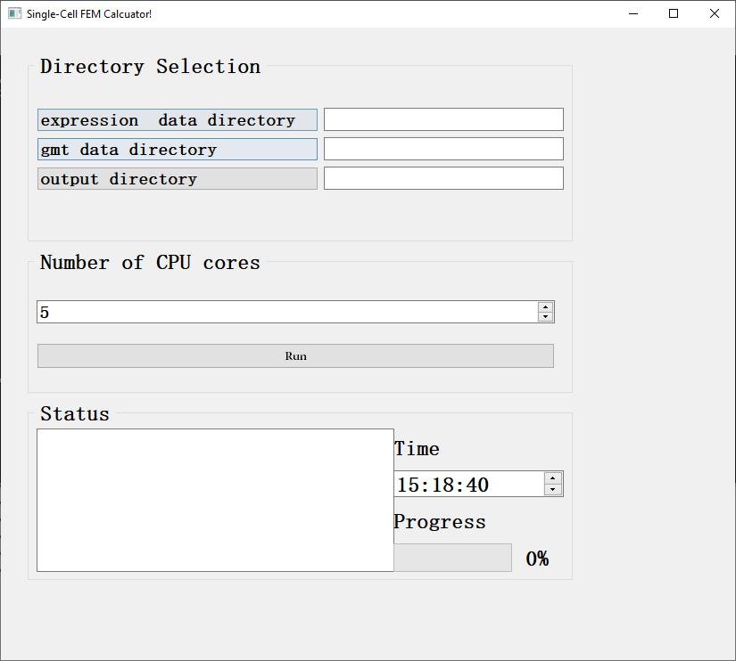

# How to use

## require

```python
pyqt5==5.15.1
scipy==1.5.2
numpy==1.19.1
pandas==1.1.1
tqdm==4.49.0
```
## data input
Our tool supports 10x data and gene expression matrix data. 10x data can be used directly as input. For expression matrix data, we provide the following conversion tools.
```python
'''
batch_processing_version\src\py_main\utils\data_processing\to_10x_batch.py is a batch conversion tool.


For the to_10x_batch.py script, users can call 
'''

to_10x_batch.py --input_dir example_directory --output_dir example_output_directory for batch transcription.

The specific parameters of to_10x_batch.py are as follows:
'--input_dir','-i', type=str, default='./totenxtest/datadir', help='the input data directory!'
'--output_dir','-o', type=str, default='./totenxtest/outdatadir', help='the output data directory!'
'--trim','-trm', type=str, default='"', help='tirm the symbol!'
'--seperater','-spr', type=str, default='', help='tirm the symbol! s for space '
```

## GUI version

```python

# go to the gui__versioin\src\py_main directory
cd ./gui__versioin/src/py_main
python main.py


```





expression data directory is the 10x format single cell expression data directory.

gmt data directory is the gene set data that similar to the misgdb format data directory.

output directory is the function expression data directory.


## Batch processing version

```python

# go to the \batch_processing_version\src\py_main
cd ./batch_processing_version/src/py_main
python main.py


# the default data and result directory are below:
batch_expr_dir = "../../data/expressions"
batch_gmt_dir = "../../data/gene_sets"
out_dir = "../../result/gsea_out"


```

## R and python script to reproduce three data sets (PBMC, liver, pancreas)

All data processing codes in Seurat are placed in the script\R_script directory.


## data download

Download link for all data:

PBMC dataset：
https://www.10xgenomics.com/resources/datasets
https://cf.10xgenomics.com/samples/cell/pbmc3k/pbmc3k_filtered_gene_bc_matrices.tar.gz

reference :
10X Genomics official website (https://www.10xgenomics.com/resources/datasets)


liver dataset：

https://www.ncbi.nlm.nih.gov/geo/query/acc.cgi?acc=GSE81252

reference :

Camp, J. G. et al. Multilineage communication regulates human liver bud development from pluripotency. Nature 546, 533–538 (2017)


pancreas dataset：

https://www.ncbi.nlm.nih.gov/geo/query/acc.cgi?acc=GSE85241

reference :

Muraro, M. J. et al. A Single-Cell Transcriptome Atlas of the Human Pancreas. Cell Syst 3, 385–394.e3 (2016)

